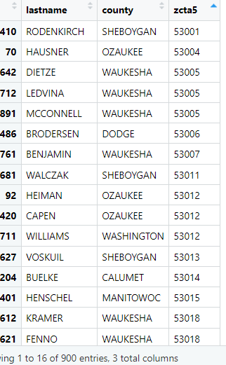
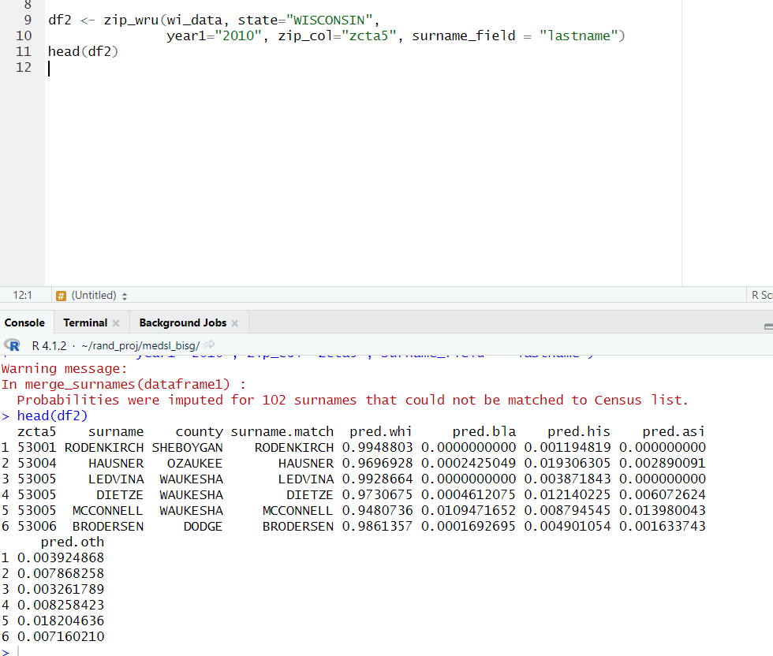
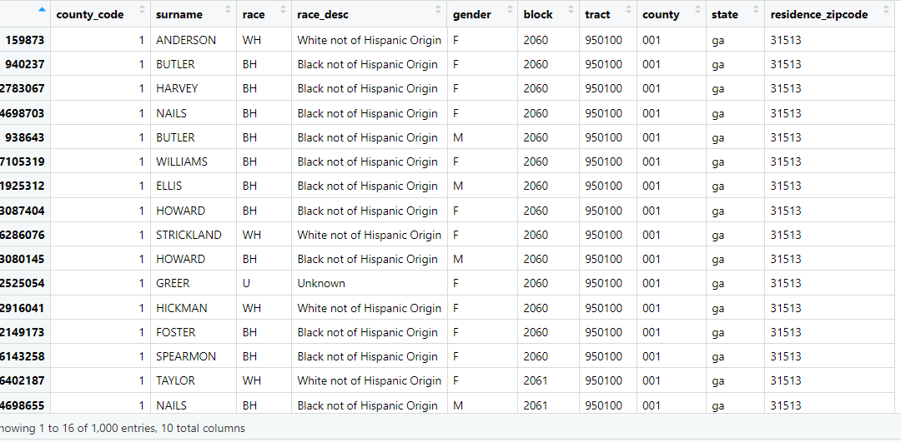
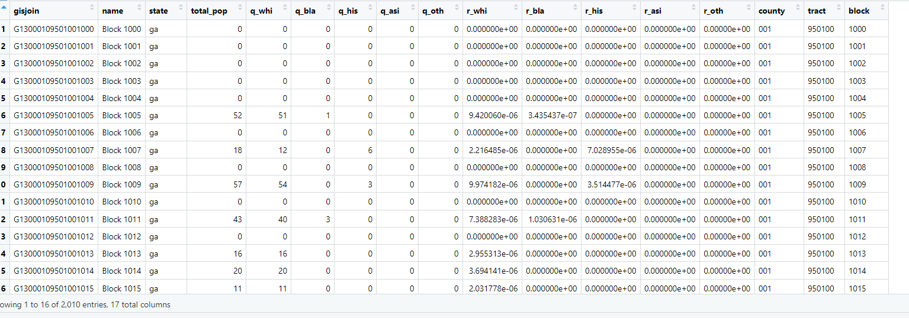
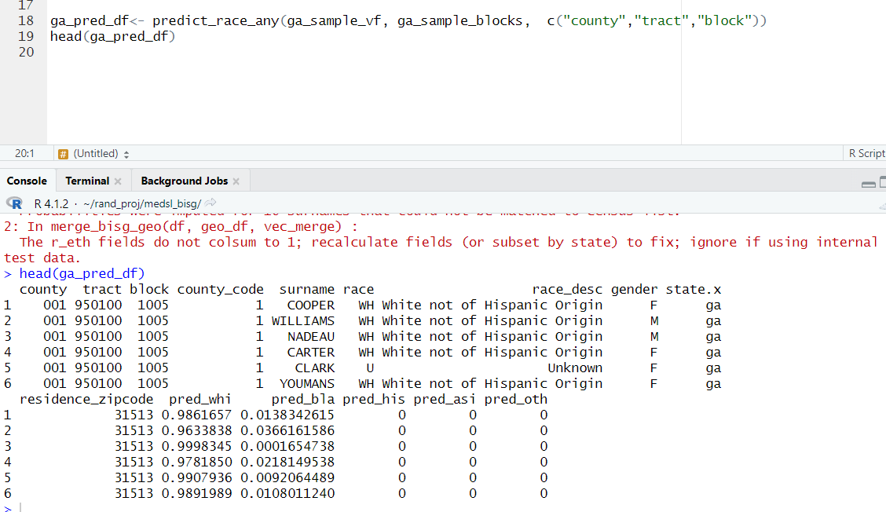
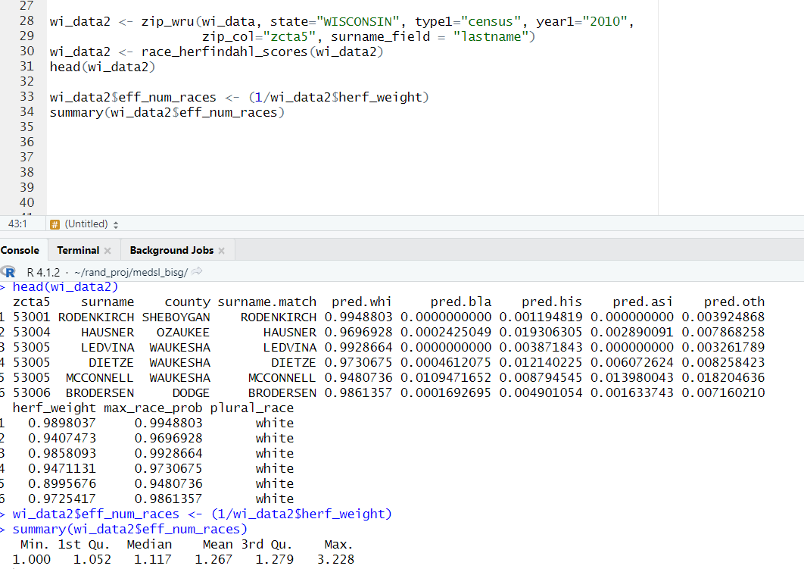
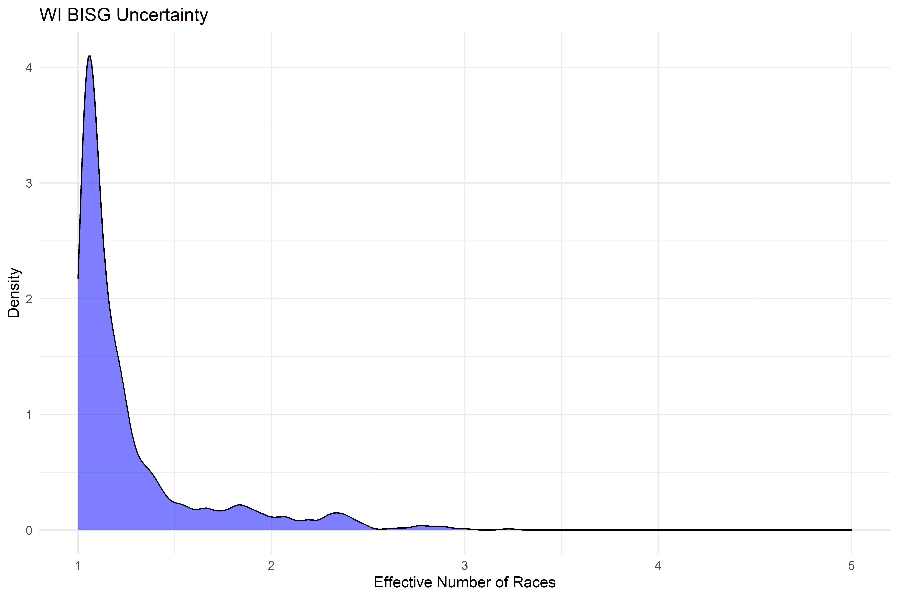
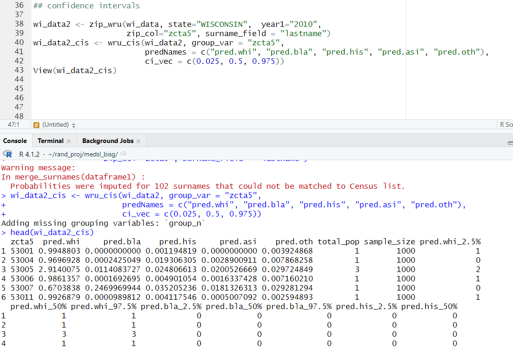
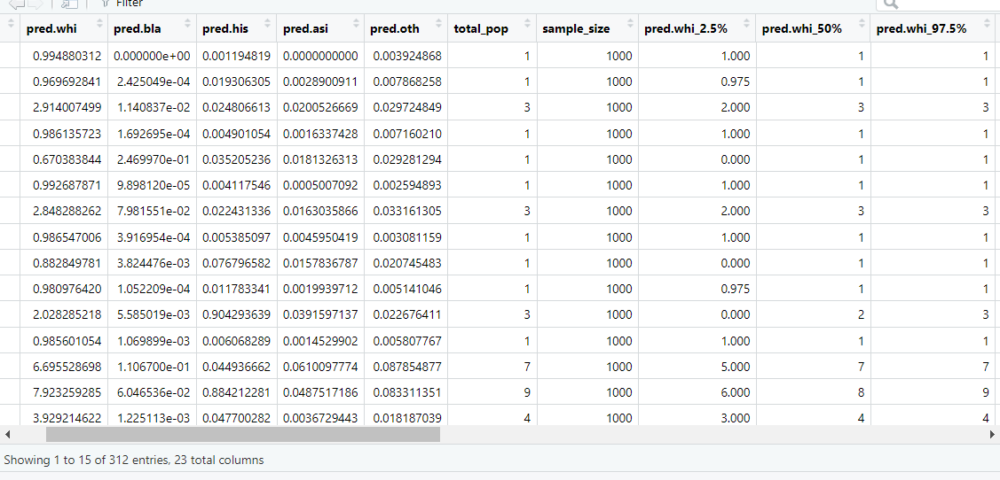
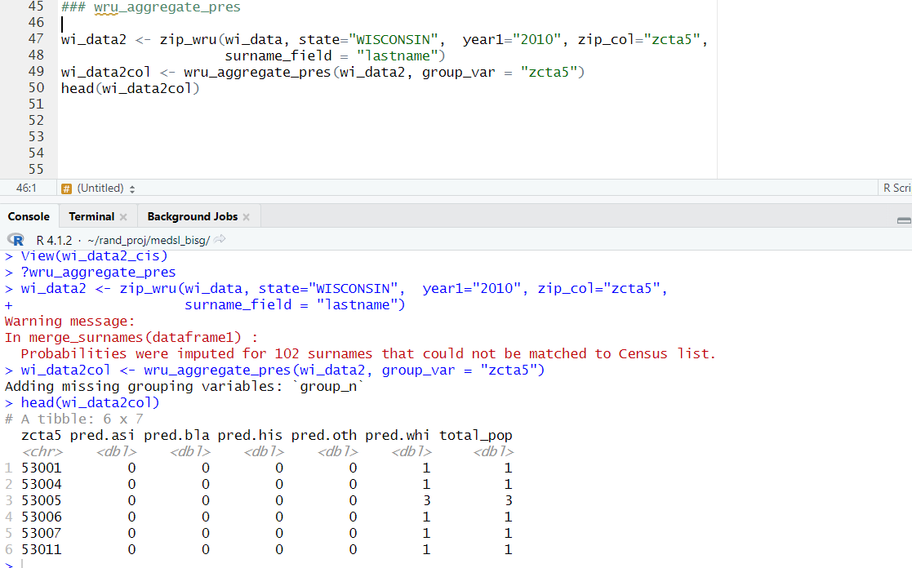

# zipWRUext2
A ZIP code extension for the WRU R package

________________________________________________________________________________________________________________________________

NOTE: Efforts pending to host on CRAN. In meantime, please install with the devtools pkg, with the following command: 

devtools::install_github("https://github.com/jcuriel-unc/zipWRUext", subdir="zipWRUext2")

________________________________________________________________________________________________________________________________

This package acts as an extension to the WRU package by Imai and Khanna (2016) in performing Bayesian Inference with Surname and Geography (BISG). The package does this 
by drawing upon ZIP code Tabulation Area (ZCTA) -- or other user provided data -- tabulated demographics from the US 2010 Census and American Community Survey (ACS) from 2011 -- 2021. This information is stored 
in the package as an internal data frame for the package, ``zip_all_census2", which has the relevant populations and demographics for each ZIP code by state. Importantly, 
the r_whi, r_bla, r_his, r_asi, and r_oth contain the probabilities that a voter lives in a ZCTA if they are of a given race, i.e. pr(race | ZCTA). These in combination with the
surname2010 dictionary provided by wru can in turn be used to identify the joint probabilities that an individual is of a given race. The following is a guide on how to use. 

## ZIP WRU -- Using ZIP Code Tabulation Areas (ZCTAs) to estimate race 

The primary command to conduct this ZIP code level BISG is zip_wru(). All the user need do is provide the voterfile or similar data frame with surname information and ZIP code residency. The user must provide dataframe (dataframe1), state name in capital letters (i.e. ``WISCONSIN", ``NORTH CAROLINA", etc.), type of data (``census" or ``acs"), year of data (``2010" for census, ``2011" to ``2021" for ACS), name of the zip code column name within the data (i.e. ``zipcode"), and surname field (i.e. ``surname", ``lastname", ``last_name", etc.). 

The above figure presents data internal to the zipWRUext2 package. As a 900 X 3 dataframe, it contains the lastname and zipcode fields. These shall be used to provide the necessary information to conduct BISG. Running the command zip_wru, we see the following output. 

The command takes the user inputted field and renames them to zcta5 and surname. The internal surname data dictionary imported from wru then matches names as part of the merge. Where the names do not match, an naive prior is used. The state name, type of data, and year then subsets the master ZCTA dataframe needed to estimate the racial category probabilities. These are seen in the fields "pred.whi", "pred.bla", "pred.his", "pred.asi", and "pred.oth", which reflect the categories of white, black, hispanic, asian/pacific islander and other, respectively. Note that these five columns all range from 0 -- 1, and sum to 1. These columns reflect the degree of certainty that an observation is of a given race. Where the surname and zip code are missing, an estimate shall not be produced. 

To ensure that the command runs correctly, please ensure that the zip code field is character, padded, and no more than five digits long. Leading zeroes can be added in R with the command, 

library(stringr)
df$zcta5 <- str_pad(df$zcta5, width=5, pad="0", side="left") 

Also note that nine digit ZIP codes refer to points, not polygons, so these should be subsetted to the first five digits.

## User created data frames 

Beyond ZIP codes and standard Census geographies, there might be others that the user would like to provide. These might consist of precincts, wards, districts, Census Block Groups (CBGs), etc. These can be implemented with some basic cleaning and the predict_race_any command. 

First, the user will need to have some type of geographic data with totals by the five racial categories of interest. All that the user will need to do is find the proportion of people of a given race that live within the geographic unit of interest. Below, we see a sample from the Georgia voter file. 

We see that the voter file includes ZIP Codes, but also the necessary information to conduct BISG at the CBG level. While neither the wru or zipWRUext2 package have built in block demographic data, all that the user needs to do is ensure that their voterfile information appears with the r_eth fields, noted below. 

The ga_sample_blocks, internal to the zipWRUext2 package, notes the total population for a given block, in addition to the number of people for a given race in the q_whi, q_bla, q_his, q_asi, and q_oth fields. These can then be used to create the r_eth fields of r_whi, r_bla, r_his, r_asi, and r_oth fields. These r_eth fields can be calculated by finding the total number of people for a given race within the sub-state geographic unit, divided by the total number of people of a given race within the state. Therefore, a given state's r_eth fields should all sum to 1 in order to ensure a proper geographic prior. 

Once the user completes their own geographic demographic dataframe, the user can make use of the predict_race_any field, seen in the example below. 

As seen in the code above, the user only needs to provide the dataframe that they are predicting upon (ga_sample_vf), the geographic prior dataframe with the r_eth fields (ga_sample_blocks), and the character vector of fields to merge onto (c("county","tract","block")). Therefore, the user needs simply make sure that the column names are the same across data sets, and the command will work without issue. The command will report an error message if the r_eth fields are not present, and a warning message if the geographic dataframe does not have r_eth fields that sum to one. 

## Measuring uncertainty in estimates. 

As a general note, the user should seek to avoid relying upon pluralistic/deterministic allocation of race, i.e. assigning an observation to a given race that they are most likely to be. DeLuca and Curiel (2022) discuss at length the issues that might arise. In the event that the user must assign races pluralistically, then the zipWRUext2 contains a couple of commands that can be of help in demonstrating uncertainty. 

The first thing that the user can do is calculate the Herfindahl index of races for a given observation. The Herfindahl index sums the squared observations, such that the closer a value is to 1, the greater certainty that an observation belongs to one category. As values approximate 0, the more diverse the potential races an observation might be part of. The inverse of the Herfindahl index amounts to the effective number

With the zipWRUext2 package, the command race_herfindahl_scores() can be used for this purpose. All that the user needs to provide is a dataframe outputted by a BISG command (i.e. zip_wru or predict_race_any) and the names of the relevant pred.eth fields in the event that the user changed these. 

The above figure presents an example using the internal WI dataframe. The new fields of interest are herf_weight, max_race_prob, and plural_race. The herf_weight consists of the Herfindahl score, which ranges from 0 - 1 as discussed above. The max_race_prob reports the highest value across the pred.eth fields. Finally, the plural race reports the race for which the maximum racial estimate is part of. The user can then take the inverse of the herf_weight value to find and report the distribution of the effective number of races, as seen below. 

The above figure presents the type of information that the user should report when demonstrating the degree of confidence across observations. With the effective number of races on the x-axis, we see the distribution of certainty in the BISG estimates. We see that while there are some outlier estimates, the vast majority of estimates within the data are centered about 1, thereby demonstrating a higher degree of confidence in the estimates. 

Finally, the user might want some explicit credibility intervals for the outputted data. Even if the user prefers estimates from a different BISG algorithm, the zipWRUext2 package contains the wru_cis command to find such credibility intervals.  All the user needs is a dataframe with the relevant pred.eth fields, and a geographic varaible by which to aggregate the data to. The following code is an example as applied to the WI data. 

We see in the above section that the data aggregates to the field zcta5, with the predNames reflecting the default pred.eth fields outputted from the zip_wru command, and a vector of numeric confidence intervals, which defaults to the 95 percent confidence interval and median estimate. The wru_cis command makes use of the rmultinom command within R to simulate 1000 potential estimates for the number of people of a given race within the geographic unit of interest. The outputted dataframe below provides an illustration of the fields of interest. 

The pred.eth fields consist of the summed estimates to the geographic level of interest. The pred.eth_ fields that follow then reflect the number of at the various intervals of interest. For example, in the code above the low range estimate at the 2.5 percentile for whites is noted in the column pred.whi_2.5%, and upper range at pred.whi_97.5%. These can then be used when reporting the general certainty for geographies of interest. 

## Rounding probability weighted estimates 

Finally, the user might desire the rounded estimates for the number of people per racial category. However, normal rounding might lead to a situation where the sum of the rounded estimates does not sum to the actual number of people within the data. Therefore, the user can make use of the wru_aggregate_pres(). All the user needs is a dataframe outputted from one of the wru commands with the pred.eth fields of interest. We see the command in action as applied to the sample WI data, as seen below. 

The command takes the zip_wru output, the aggregates the estimates (not assigned pluralistically) to the geographic level of interest. Next, the command applies the internal function -- round_preserve_sum -- to the data, which both rounds the estimates while ensuring that the rounded data adheres to the total population within the dataframe before transformation. Therefore, while there might be rounding error, such estimates avoid the bad practice of pluralistic assignment as noted by DeLuca and Curiel. 

## References 

DeLuca, Kevin, and John A. Curiel. ``Validating the Applicability of Bayesian Inference with Surname and Geocoding to Congressional Redistricting." Political Analysis, 2022, 1–7. doi:10.1017/pan.2022.14.

https://www.cambridge.org/core/journals/political-analysis/article/abs/validating-the-applicability-of-bayesian-inference-with-surname-and-geocoding-to-congressional-redistricting/333B3BC8C85EA27E0F4FD2A245D44246 

## Version notes 

Update 1/7/2023: The new confidence interval commands added. 

Update 10/21/2020: The internal loop present within the old zip_wru function has been removed. The speed is now 16 times quicker, and out of state ZIP codes no longer cause the function to report an error. 

In order to test the data, please be sure to make  use of the wi_data, which is part of the package. 

Finally, an important substantive note: This package extension, much like the original WRU package, treats race as zero sum, and Hispanic as a race. Therefore, keep this in mind
in the event for substantive work. While there are good reasons why this might lead to complications, its the case that to correct this would require more than just an 
extension of WRU to correct, which is beyond the scope of this project as of now. 
